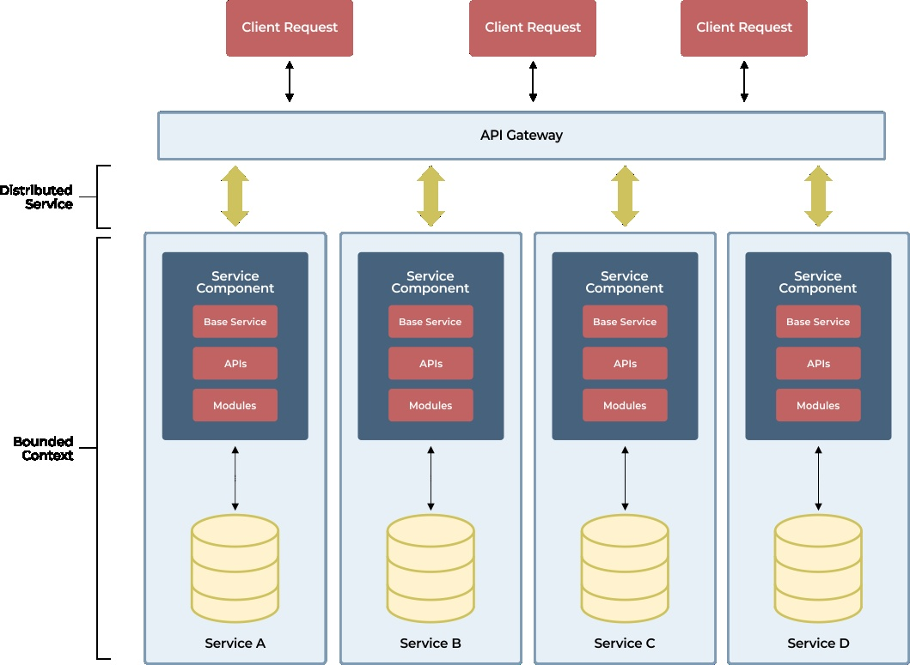

# Amplify Security Project



## Project Overview
This project demonstrates a simple microservice built with Python using Flask. It implements endpoints for accessing both SQL and NoSQL databases and includes a security check endpoint.

## Features
- **Get RDBMS data**: Retrieve data from a sample RDBMS (SQLite).
- **Get NoSQL data**: Retrieve data from a sample MongoDB collection.
- **Security Check**: A POST endpoint that simulates a security check for provided input.

## Prerequisites
- Python 3.x
- pip (Python package installer)
- SQLite3 (for RDBMS)
- MongoDB (for NoSQL)

## Getting Started
### Step 1: Clone the repository
```bash
git clone <repository-url>
cd amplify-security-project
```

### Step 2: Install dependencies
```bash
pip install -r requirements.txt
```

### Step 3: Set up the databases
- **For SQLite**: Run the SQL setup file to create the required table:
```bash
sqlite3 example.db < setup.sql
```
- **For MongoDB**: Make sure MongoDB server is running and create a database and collection.

### Step 4: Run the application
```bash
python app.py
```

### Step 5: Test the endpoints
You can use a tool like Postman or CURL to test the endpoints:
- **RDBMS Data**: `GET http://127.0.0.1:5000/api/rdbms/data`
- **NoSQL Data**: `GET http://127.0.0.1:5000/api/nosql/data`
- **Security Check**: `POST http://127.0.0.1:5000/api/security/check`

## Notes
- Ensure you have appropriate permissions set for your database and application.
- Feel free to reach out for further documentation or clarifications.

## License
This project is licensed under the MIT License - see the LICENSE file for details.
